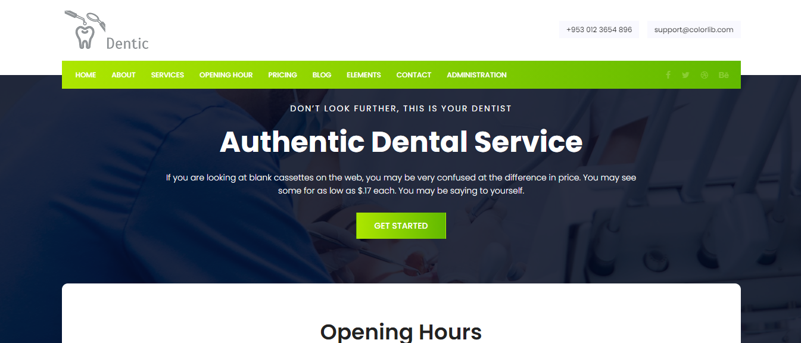

## Introduction

Dentic is a web application for managing a dental care office.

## Informations
-   Status : under development
-   Lastest version : 1.0
-   Status : Medical
-   Created: October 2020
-   Last update: October 2020

## Table of contents
* [Documentation](#general-info)
* [Demo](#demo)
* [Screenshots](#screenshots)
* [Technologies](#technologies)
* [Setup](#setup)
* [Features](#features)
* [Status](#status)
* [Contact](#contact)
* [License](#license)

## Documentation
https://github.com/aniskchaou/DENTIC-FRONTEND-CLIENT/wiki

## Demo
https://dentic-client.herokuapp.com/

## Screenshots

## Technologies
* Spring boot
* React.js
* Node.js

## Setup

## Features
 -  Manage appointments
-   Manage patients
-   Manage medications
-   Manage prescriptions
-   Manage users

  

## Contact
contact@delta-dev-software.com

## License
<a href="license.txt">MIT License</a>
